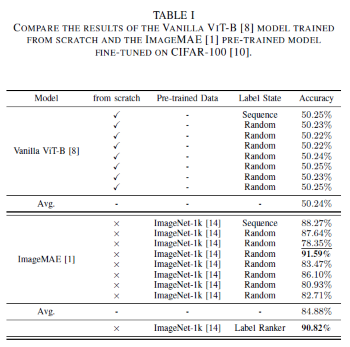

# Label Ranker: Self-aware Preference for Classification Label Position in Visual Masked Self-supervised Pre-trained Model

[](https://paperswithcode.com/sota/image-classification-on-cifar-100?p=label-ranker-self-aware-preference-for)<br>
[](https://paperswithcode.com/sota/human-activity-recognition-on-hmdb51?p=label-ranker-self-aware-preference-for)<br>
[](https://paperswithcode.com/sota/human-activity-recognition-on-ucf-101?p=label-ranker-self-aware-preference-for)<br>

> [](https://hcps.fiu.edu/) [](https://www.preprints.org/manuscript/202503.0003/v1) [](#citation)<br>
> [Peihao Xiang](https://scholar.google.com/citations?user=k--3fM4AAAAJ&hl=zh-CN&oi=ao), [Kaida Wu](https://ieeexplore.ieee.org/author/167739911238744), and [Ou Bai](https://scholar.google.com/citations?hl=zh-CN&user=S0j4DOoAAAAJ)<br>
> HCPS Laboratory, Department of Electrical and Computer Engineering, Florida International University<br>

[](https://colab.research.google.com/github/Peihao-Xiang/Label-Ranker/blob/main/Label-Ranker%20Code/Label_Ranker.ipynb)
[](https://huggingface.co/datasets/NoahMartinezXiang/UCF101)

Official TensorFlow implementation and Label Ranker codes for Label Ranker: Self-aware Preference for Classification Label Position in Visual Masked Self-supervised Pre-trained Model.

Note: The .ipynb is just a simple example. In addition, the VideoMAE encoder model should be pre-trained using the Self-supervised method, but this repository does not provide it.

## Overview

This paper investigates the impact of randomly initialized unique encoding of classification label position on the visual masked self-supervised pre-trained model when fine-tuning downstream classification tasks. Our findings indicate that different random initializations lead to significant variations in fine-tuned results, even when using the same allocation strategy for classification datasets. The accuracy gap between these results suggests that the visual masked self-supervised pre-trained model has an inherent preference for classification label positions. To investigate this, we compare it with the non-self-supervised visual pre-trained model and hypothesize that the masked self-supervised model exhibits a self-aware bias toward certain label positions. To mitigate the instability caused by random encoding, we propose a classification label position ranking algorithm, Label Ranker. It is based on 1-D dimensionality reduction of feature maps using Linear Discriminant Analysis and position-rank encoding of them by unsupervised feature clustering using the similarity property of Euclidean distance. This algorithm ensures that label position encoding align with the model’s inherent preference. Extensive ablation experiments using ImageMAE and VideoMAE models on the CIFAR-100, UCF101, and HMDB51 classification datasets validate our approach. Results demonstrate that our method effectively stabilizes classification label position encoding, improving fine-tuned performance for visual masked self-supervised models.

<p align="center">
  <br>
</p>

Fig. 1 Illustration of the Problem Origin. The impact of randomly initializing the unique position encoding of the classification labels.

## Implementation details

<p align="center">
  <br>
</p>

Fig. 2 Label Ranker Processing: Linear Discriminant Analysis is used to reduce the dimension of features into 1-D and map them to the linear projection panel.

<p align="center">
  <br>
</p>

Fig. 3 Classification Label Sequence. Calculate the centroid and Euclidean distance of various 1-D projected feature points for position ranking.

## Main Results

### CIFRA-100



### UCF101


### HMDB51


## Contact 

If you have any questions, please feel free to reach me out at pxian001@fiu.edu.

## Acknowledgments
This project is built upon [ImageMAE](https://github.com/facebookresearch/mae), [kerasMAE](https://keras.io/examples/vision/masked_image_modeling/) and [VideoMAE](https://github.com/innat/VideoMAE). Thanks for their great codebase.

## License

This project is under the Apache License 2.0. See [LICENSE](LICENSE) for details.

## Citation

If you find this repository helpful, please consider citing our work:

```BibTeX
@article{202503.0003,
	doi = {10.20944/preprints202503.0003.v1},
	url = {https://doi.org/10.20944/preprints202503.0003.v1},
	year = 2025,
	month = {March},
	publisher = {Preprints},
	author = {Peihao Xiang and Kaida Wu and Ou Bai},
	title = {Label Ranker: Self-Aware Preference for Classification Label Position in Visual Masked Self-Supervised Pre-Trained Model},
	journal = {Preprints}
}
```
